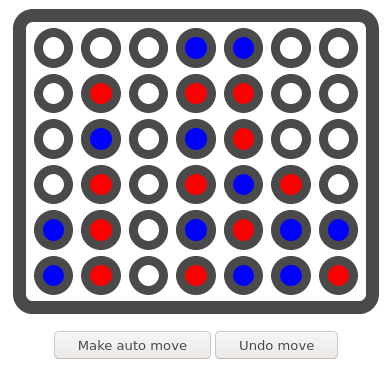

# Connect4
This is [connect-four](https://en.wikipedia.org/wiki/Connect_Four) AI written
in C++ and compiled to WASM which allows to run it 100% on the client.
You can adjust algorithms search depth and try to beat it at various difficulty
levels. Feel free to check your skilz [here.](http://connect4.antoniszczepanik.com)



You could also use it to cheat, but hey, I hope you're not a cheater.

### Why is it interesting?

AI uses [MiniMax](https://en.wikipedia.org/wiki/Minimax) algorithm which explores
tree of possible moves. A lot of board valuations are performed, so valuation
function and win checking function need to be REALLY fast.
To achieve that 64bit representation is used for the board.
It allows to check for a win with few bitshifts, which is kinda insane.
Dominikus Herzberg has written [excellent
article](https://github.com/denkspuren/BitboardC4/blob/master/BitboardDesign.md)
explaining how it works.

```txt
  6 13 20 27 34 41 48   55 62     Additional row
+---------------------+ 
| 5 12 19 26 33 40 47 | 54 61     top row
| 4 11 18 25 32 39 46 | 53 60
| 3 10 17 24 31 38 45 | 52 59
| 2  9 16 23 30 37 44 | 51 58
| 1  8 15 22 29 36 43 | 50 57
| 0  7 14 21 28 35 42 | 49 56 63  bottom row
+---------------------+
```

### Search algorithm 

To search the game tree MiniMax algorithm is used. In contrary to popular
approach I did not use alpha/beta prunning, which allows to compare all 
winning/loosing moves that otherwise would be pruned once first one was 
detected. This makes the AI more "human like" - even if it wins, it picks moves
that will result in the quickest win. If it looses it "delays" end of the game
as much as possible.

In my opinion it makes a better oponnent, even though we tradeoff search depth.

### TODO:
#### Comparison between native and WASM performance.

How fast are bitwise operations in WASM? How much overhead is introduced
by running the code on 32bit cpu?

Comparing to native C++ implementation WASM code is around X% slower,
on 2.1Ghz AMD CPU and Y% slower on iPhone.
Bitboard implementation allows it evaluate around X boards
positions/second, which means exploring tree with depth of Z is (not) 
feaseable on mobile.

\*Disclaimer - the game has been solved, but such a huge game tree makes 
it interesting playground nonetheless.
